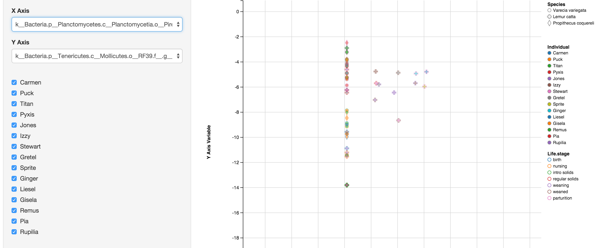
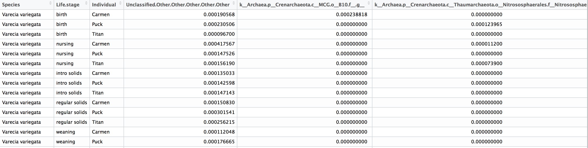

# VisCount

## Description
A versatile visualization tool for exploring count data. This tool enables you to quickly investigate and visualise relationships within your dataset.

If you provide this program with a file containing relative count data (such as output from QIIME), it will generate an interactive plot in the browser that will:

* Compare the abundance of two different count data variables against one another and select which variables to compare interactively
* Visualise and filter data for up to 3 different factors
* Zoom in to regions of the plot: the program calculates the best scale to use
* Interactively modify the opacity and size of your datapoints
* The stroke (line around points) can be interactively thickened to become the main feature of the point
* Select whether or not you want to log your data and what to replace 0 values with
* Download the plot you have customised

To increase the size of the plot (if it is too small or parts are not visible), please click the little triangle icon on the bottom-right of the figure and drag down to the expand the plot.

__Include pictures showing the filter in action__

## Paper
In progress.

## Demonstration

A demonstration of the tool on the example lemur dataset will be available on a website shortly.

## Program Requirements
This program requires the R programming environment, which is freely [available here](https://www.r-project.org/). This tool uses the [ggvis](https://cran.r-project.org/web/packages/ggvis/index.html) and [dplyr](https://cran.r-project.org/web/packages/dplyr/index.html) packages, although it will install these automatically when you run the program for the first time.

## Data Requirements

Data is required to be in the form of a CSV (comma separated file) or TSV (tab separated file) and to have a header for each column. Factors should be in their own column, and you can have between 0-3 factors.

For an example of the correct data structure, please see the example dataset in the "data" directory.

## Example
Once you have installed R and navigated into the VisCount directory in terminal, you can run the program using the example lemur dataset provided in the "data" directory:

`Rscript VisCount.R data/lemurs.txt tab 0.000001 Life.stage Species Individual`

This line has 8 words in it that do the following things:

Parameter | Purpose
--- | ---
`Rscript`| Calling the R language
`VisCount.R` | VisCount Program
`data/lemurs.txt` | Data file, includes path relative to program
`tab` | Separator in data file: can be "tab" or "comma" separated
`0.000001` | Value to replace 0s with if you log the data
`Life.stage` | First factor in data
`Species` | Second factor in data
`Individual` | Third factor in data

Please note that the order of the parameters in the command is important: while you can vary the number of factors (from 0-3), the factors you name must always come last when you run the program.

## Factors

The VisCount program can support up to three factors. Depending on how many factors your dataset contains, the following will happen:

Factors | Action
:---: | :---
0 | The points will be plotted without colour.
1 | Points will be coloured and filtered based on this factor.
2 | Points will be filtered based on both factors. The factor with the most levels will be used to colour the points, while the other factor will provide the coloured stroke around the points.
3 | Points will be filtered based on all 3 factors. Same as with 2 factors and the factor with the fewest levels will be used to set the shape of the points. Please ensure that this factor has 6 or fewer levels, as there are only so many shapes we can use before we have to repeat them in the legend.

Please note that if none of the factor levels are checked, all points will be automatically replotted to avoid an empty figure.

## Logging Data

If you do not wish to have a log transform applied to your data, retain all 0s when you run the program.

## Saving Figures

Figures can be downloaded by clicking the gear icon in the top left of the page and selecting the SVG or canvas option.

## Uses

* Metagenomics data output from QIIME

## Advanced Use

The section of the code that generates this graphic has been contained in the `visualisation()` function within the "visualisation.R" file. Feel free to tinker with the code for your own use, just please provide attribution.

## Authors

Jack Bruce Simpson1, Erin A. McKenney2, Allen Rodrigo1, David Lovell3

1Australian National University, Canberra, ACT, Australia 
2Duke University, Durham, North Carolina, USA 
3Queensland University of Technology, Brisbane, Queensland, Australia 

## Licence
This software is shared under the [MIT license](http://choosealicense.com/licenses/mit/) which means you're free to do whatever you like with the code so long as you provide attribution.
