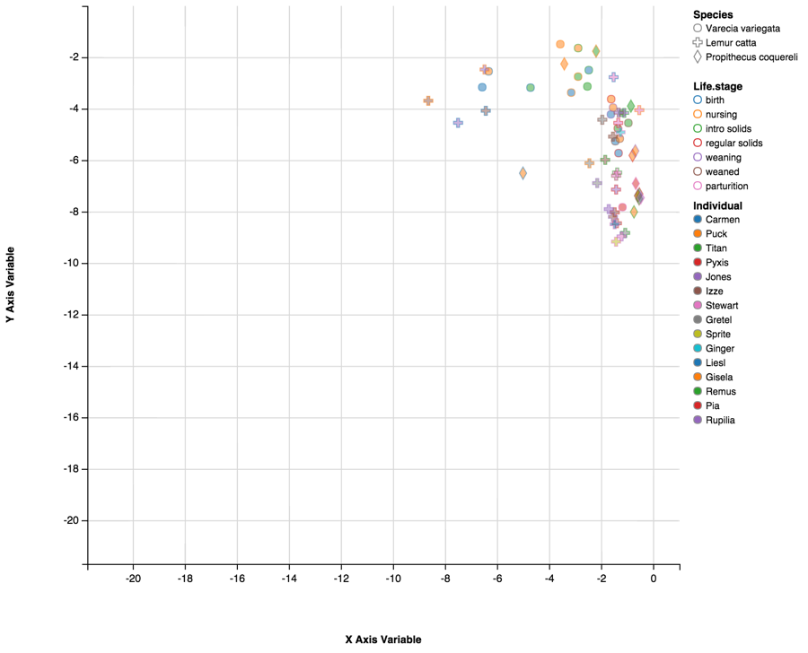
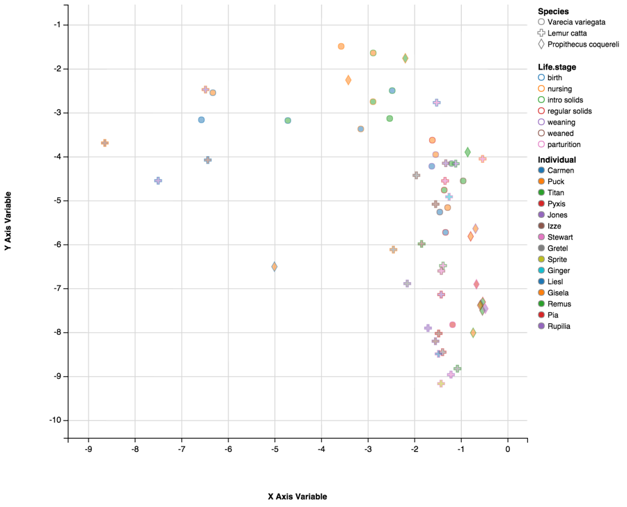
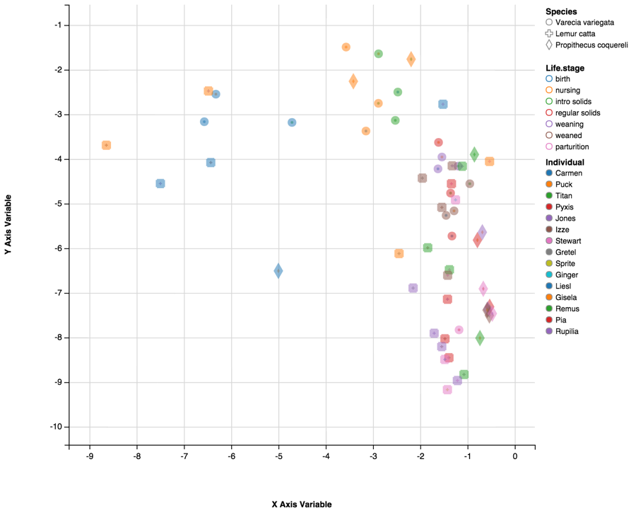
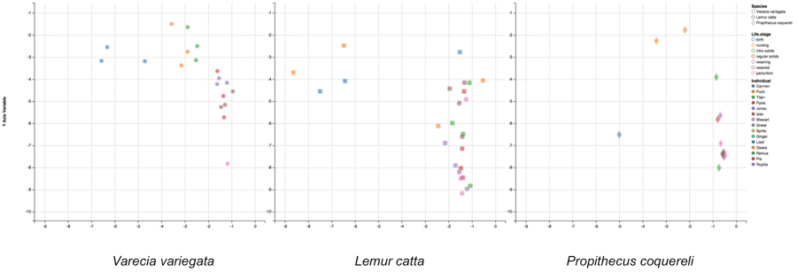
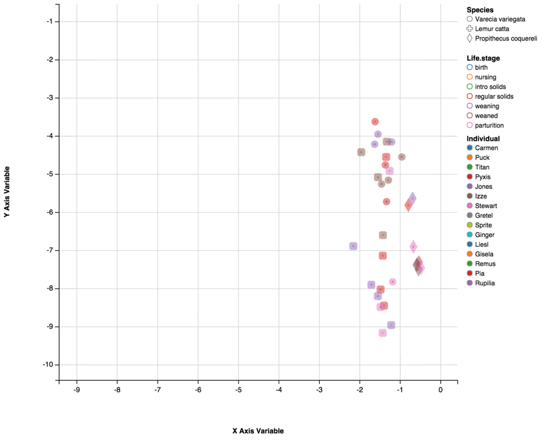

# Data Exploration Tutorial

I decided to compare Clostridia and Bacilli, two classes within Phylum Firmicutes. Firmicutes comprises a majority component of the mammalian gut microbiome. Both classes contain several known pathogens; however, Clostria are distinguished from Bacilli by their lack of aerobic respiration. Because the gut is anearobic, this makes Clostria better adapted to that environment.

I used the sliders for X and Y range to “zoom in” on the cluster. This helped to spread the points out a bit, so I could begin to see some patterns. At first glance, it looks like Species (denoted by shape) is the most obvious factor determining distribution. This makes sense, because each lemur species has a different gut length and transit time (both of which affect oxygen levels in the gut), and eats a different diet (which is also known to shape microbiome community structure).

However, when I decrease the point size and increase stroke width, I see that Life Stage definitely has an affect as well. Now we are able to see that Clostridia increases with age (left to right), and that Bacilli decreases as Clostridia increases.

These trends are conserved across Species; but I can still see that species-specific clusters form in later Life Stages (after the introduction of solid foods).

Time to do the “Peel Away”! I’m going to use a few different approaches to investigate underlying patterns.

First, I’d like to compare the Clostridia-Bacilli relationship in each species. I’m keeping them on the same scale so that species-specific behaviors will be immediately apparent. And, indeed, they are! As we established in the Life stage exercise (above), Clostridia levels increase with age. However, now we can see that infants within each species begin life with a different relative amount of Clostridia, but progresses toward a similar adult frequency. Bacilli, by contrast, are much more variable between individuals at each Life stage.

Now I’ll filter by Life stage, to see how the transition from nursing to solid food affects the relationship between Clostridia and Bacilla. After de-selecting and re-selecting through the life stages a couple of times, I can see that the relationship between Clostridia and Bacilli stabilizes once infants have begun to consume solid foods on a regular (i.e. daily) basis.

Time to zoom in again! Now the species affects are more clear.  Propithecus coquereli has much higher levels of Clostridia, probably because it has a longer gut (which promotes the anaerobic conditions Clostridia need to thrive). _Varecia variegata_ and Lemur catta are more variable and have a similar range of Clostridia frequencies, it looks like _V. variegata_ tends to have more Bacilli. This also correlates to gut length: _L. catta’s_ gut is twice as long, so that may limit the growth of Bacilli.  
